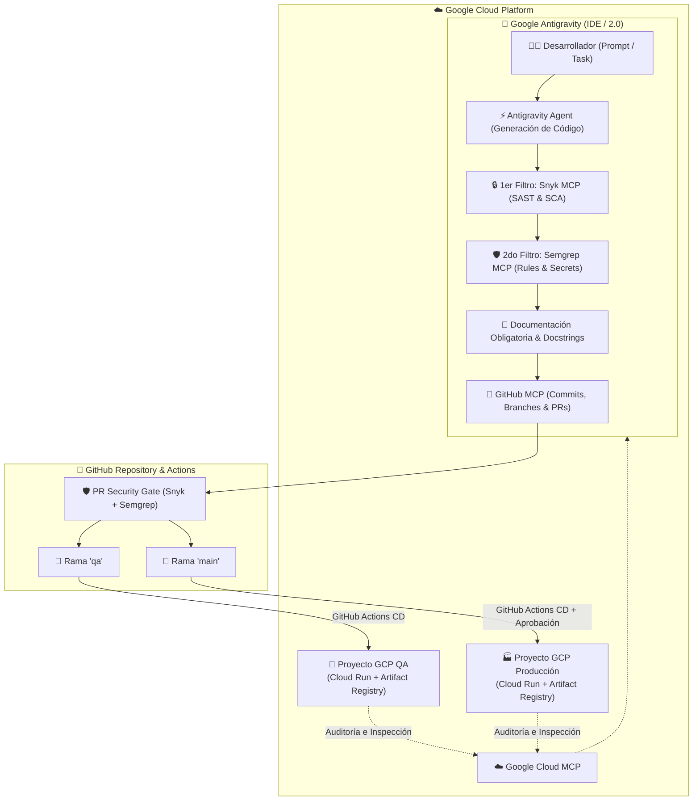

# 🛡️ Plantilla Corporativa de Desarrollo Seguro Agéntico (DevSecOps Framework)

Plantilla de repositorio empresarial diseñada para estandarizar el ciclo de desarrollo seguro asistido por Inteligencia Artificial agéntica. Integra **Google Antigravity** como generador y asistente de código, **Snyk.io** como primer filtro de seguridad, **Semgrep.dev** como segundo filtro de seguridad, **GitHub MCP** para interacción directa con el repositorio, **Google Cloud MCP** para observabilidad e infraestructura, **GitHub Actions** para integración continua con gestión de secretos, y **Google Cloud Platform (GCP)** con proyectos independientes para **QA** y **Producción**.

---

## 🏗️ Arquitectura del Sistema



---

## ⚡ Stack Tecnológico y Servidores MCP

- **Generador de Código Agéntico:** [Google Antigravity](https://deepmind.google/technologies/antigravity/) (IDE / Antigravity 2.0 / CLI).
- **1er Filtro de Seguridad:** [Snyk.io](https://snyk.io/) (Escaneo SAST de código fuente y SCA de dependencias vía MCP y GitHub Actions).
- **2do Filtro de Seguridad:** [Semgrep.dev](https://semgrep.dev/) (Escaneo SAST estático avanzado y prevención de fuga de secretos vía MCP y GitHub Actions).
- **Integración de Repositorio:** [GitHub MCP Server](https://github.com/modelcontextprotocol/servers/tree/main/src/github) (Gestión de PRs, issues y ramas por el agente).
- **Integración de Nube:** [Google Cloud MCP Server](https://github.com/google-cloud) (Monitoreo de Cloud Run, Artifact Registry y Logs).
- **Control de Versiones & CI/CD:** GitHub + GitHub Actions + GitHub Environments.
- **Plataforma Cloud:** Google Cloud Platform (GCP) con **Cloud Run** y **Artifact Registry**.
- **Autenticación Cloud:** GCP Workload Identity Federation (sin claves estáticas de servicio).

---

## 🚀 Cómo Instalar y Usar este Proyecto desde Google Antigravity

### 1. Clonar y Abrir en Antigravity
Puedes abrir el proyecto directamente en **Antigravity IDE** o mediante el CLI de Antigravity (`agy`):

```bash
# Clonar el repositorio
git clone https://github.com/<tu-organizacion>/<tu-repo>.git
cd <tu-repo>

# Si usas Antigravity CLI (2.0):
agy
```

Al abrir la carpeta, Antigravity detecta y activa automáticamente las reglas maestras definidas en [`GEMINI.md`](GEMINI.md) y [`.agent/rules/`](.agent/rules/).

### 2. Configurar los 4 Servidores MCP (Snyk, Semgrep, GitHub y Google Cloud)
Asegúrate de que tu configuración de MCP en `~/.gemini/config/mcp_config.json` tenga habilitados los servidores (ver [`.gemini/mcp_config.json.template`](.gemini/mcp_config.json.template)):

```json
{
  "mcpServers": {
    "snyk": {
      "command": "npx",
      "args": ["-y", "@snyk/snyk-mcp-server"],
      "env": {
        "SNYK_TOKEN": "TU_SNYK_API_TOKEN"
      }
    },
    "semgrep": {
      "command": "semgrep",
      "args": ["mcp"],
      "env": {
        "SEMGREP_APP_TOKEN": "TU_SEMGREP_TOKEN"
      }
    },
    "github": {
      "command": "npx",
      "args": ["-y", "@modelcontextprotocol/server-github"],
      "env": {
        "GITHUB_PERSONAL_ACCESS_TOKEN": "TU_GITHUB_PAT"
      }
    },
    "google-cloud": {
      "command": "npx",
      "args": ["-y", "@google-cloud/mcp-server"],
      "env": {
        "GCP_PROJECT_ID": "TU_PROYECTO_GCP_ID",
        "GOOGLE_APPLICATION_CREDENTIALS": "/ruta/a/credencial.json"
      }
    }
  }
}
```

### 3. Bootstrapping Asistido por Antigravity
Puedes escribirle directamente a Antigravity en el chat:
> *"Hola Antigravity, inicializa el entorno virtual de Python, instala las dependencias de `app/requirements.txt`, ejecuta los tests con pytest y verifica las herramientas MCP disponibles."*

---

## 🛡️ Directivas Mandatorias del Framework

### 1. Doble Filtro de Seguridad Pre-Commit / Pre-Push
Cualquier código generado o modificado por Antigravity debe ser validado con:
- `snyk_code_scan` / `snyk_sca_scan`: 0 vulnerabilidades abiertas de severidad Media/Alta/Crítica.
- `semgrep`: 0 violaciones de reglas de seguridad o credenciales expuestas.

### 2. Documentación Integral en Cada Commit / Push
- Todo código debe contener **docstrings estructurados**, tipos de datos y explicaciones técnicas de seguridad.
- La documentación técnica (`/docs`, diagramas, OpenAPI) se debe actualizar y enviar **en el mismo commit** en el que se añade el código.

---

## 🌿 Flujo de Ramas y Despliegue en GCP

| Rama | Entorno GCP | Pipeline CI/CD | Descripción |
| :--- | :--- | :--- | :--- |
| `feature/*` | Local / Antigravity | `.github/workflows/pr-security-gate.yml` | Desarrollo y validación estricta de PRs. |
| `qa` | **GCP QA** | `.github/workflows/cd-qa.yml` | Despliegue automático a Cloud Run en QA. |
| `main` | **GCP Producción** | `.github/workflows/cd-prod.yml` | Despliegue a Cloud Run en Producción tras validación completa. |

---

## 📁 Estructura del Repositorio

```
DEvSecOps Framework/
├── .agent/
│   └── rules/
│       ├── 01-security-gates.md       # Regla: Doble filtro Snyk + Semgrep
│       └── 02-documentation-rules.md  # Regla: Documentación obligatoria con cada commit
├── .gemini/
│   └── mcp_config.json.template       # Plantilla de configuración MCP (Snyk, Semgrep, GitHub, GCP)
├── .github/
│   ├── workflows/
│   │   ├── pr-security-gate.yml       # Validación SAST/SCA en PRs (Snyk + Semgrep)
│   │   ├── cd-qa.yml                  # Despliegue continuo a GCP QA (rama qa)
│   │   └── cd-prod.yml                # Despliegue continuo a GCP Producción (rama main)
│   └── pull_request_template.md       # Template de PR con checklist DevSecOps
├── app/                               # Microservicio base listo para producción
│   ├── main.py                        # API FastAPI con cabeceras de seguridad y health check
│   ├── requirements.txt               # Dependencias fijadas
│   ├── Dockerfile                     # Dockerfile multi-stage hardening (non-root)
│   └── tests/
│       └── test_main.py               # Pruebas unitarias
├── docs/                              # Documentación técnica y guías de onboarding
│   ├── 01-onboarding-developer.md     # Guía paso a paso para nuevos desarrolladores
│   ├── 02-antigravity-mcp-setup.md    # Configuración de Antigravity y suite de 4 MCPs
│   ├── 03-branching-and-git-flow.md   # Estrategia de ramas y políticas de commit
│   ├── 04-github-secrets-config.md    # Configuración de secretos en GitHub Actions
│   └── 05-gcp-environments-setup.md  # Setup de GCP QA y Producción con WIF
├── terraform/                         # Infraestructura como Código (IaC) para GCP
│   ├── environments/
│   │   ├── qa/
│   │   └── prod/
│   └── main.tf
├── .gitignore
├── .editorconfig
├── GEMINI.md                          # Reglas globales raíz para Google Antigravity
└── README.md                          # Documento maestro del framework
```

---

## 📚 Documentación Adicional

- [📖 Guía de Onboarding para Nuevos Desarrolladores](docs/01-onboarding-developer.md)
- [🤖 Configuración de Antigravity & Suite MCP](docs/02-antigravity-mcp-setup.md)
- [🌿 Estrategia de Ramas y Commits](docs/03-branching-and-git-flow.md)
- [🔐 Guía de Secretos en GitHub Actions](docs/04-github-secrets-config.md)
- [☁️ Configuración de Proyectos en GCP y Workload Identity](docs/05-gcp-environments-setup.md)
