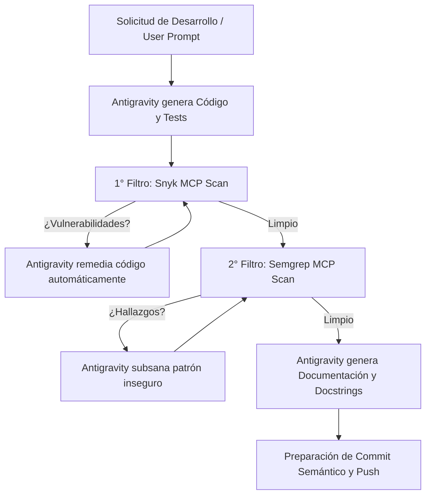

# 🤖 Instalación y Configuración desde Google Antigravity (IDE & 2.0)

Este documento detalla el procedimiento para instalar, inicializar y operar este proyecto directamente desde **Google Antigravity** (tanto en modo **IDE** como en **Antigravity 2.0 CLI / Agentic Stack**).

---

## 📥 Opción A: Instalación Inicial desde Antigravity IDE

1. **Abrir Antigravity IDE**:
   - Inicia Antigravity IDE en tu equipo.
   - Selecciona **File > Open Folder...** (o `Cmd+O` / `Ctrl+O`) y abre la carpeta raíz de este repositorio: `DEvSecOps Framework/`.
2. **Detección Automática de Reglas (`GEMINI.md`)**:
   - Antigravity detecta y aplica automáticamente el archivo [`GEMINI.md`](../GEMINI.md) y las reglas en [`.agent/rules/`](../.agent/rules/).
   - Verás en el panel lateral del agente que las directivas de seguridad y documentación ya se encuentran activas en el contexto.

---

## 💻 Opción B: Instalación Inicial desde Antigravity 2.0 CLI (`agy`)

Si utilizas el CLI de Antigravity (`agy`):

1. **Navegar al directorio del proyecto o clonar desde GitHub**:
   ```bash
   git clone https://github.com/<tu-organizacion>/<tu-repo>.git
   cd <tu-repo>
   ```
2. **Iniciar la sesión agéntica con el contexto del workspace**:
   ```bash
   agy
   ```
3. **Instruir a Antigravity para bootstrapear el entorno**:
   Puedes solicitarle directamente al prompt de Antigravity:
   > *"Hola Antigravity, por favor configura el entorno virtual local de Python, instala las dependencias de `app/requirements.txt`, ejecuta los tests unitarios y verifica el estado de las herramientas MCP de Snyk y Semgrep."*

---

## 🔌 Configuración de Servidores MCP (Snyk & Semgrep)

Antigravity utiliza el **Model Context Protocol (MCP)** para conectarse con los motores de seguridad de Snyk y Semgrep.

### 1. Configuración Global de MCP en Antigravity
Edita o crea el archivo `~/.gemini/config/mcp_config.json` en tu máquina local:

```json
{
  "mcpServers": {
    "snyk": {
      "command": "npx",
      "args": ["-y", "@snyk/snyk-mcp-server"],
      "env": {
        "SNYK_TOKEN": "TU_SNYK_API_TOKEN"
      }
    },
    "semgrep": {
      "command": "semgrep",
      "args": ["mcp"],
      "env": {
        "SEMGREP_APP_TOKEN": "TU_SEMGREP_TOKEN"
      }
    }
  }
}
```

> 💡 **Nota:** Para obtener tus tokens:
> - **Snyk:** Inicia sesión en [snyk.io](https://app.snyk.io/) > *Account Settings > API Token*.
> - **Semgrep:** Inicia sesión en [semgrep.dev](https://semgrep.dev/) > *Settings > Tokens*.

### 2. Verificar Herramientas MCP Activas en Antigravity
En el chat de Antigravity, puedes verificar que las herramientas estén disponibles ejecutando o preguntando:
- `¿Cuáles herramientas de Snyk y Semgrep tienes disponibles?`
- Las herramientas visibles incluirán `snyk_code_scan`, `snyk_sca_scan`, `snyk_container_scan`, etc.

---

## 🛠️ Flujo de Desarrollo Asistido por Antigravity

Al solicitarle a Antigravity la creación o modificación de una funcionalidad, el ciclo se ejecuta automáticamente según las reglas de `GEMINI.md`:



### Ejemplo de Prompt para Antigravity:
> *"Crea un nuevo endpoint para autenticación JWT en `/api/v1/auth/login`. Recuerda aplicar el 1er filtro con Snyk y el 2do filtro con Semgrep, añadir pruebas unitarias completas y documentar todos los esquemas Pydantic y docstrings."*
