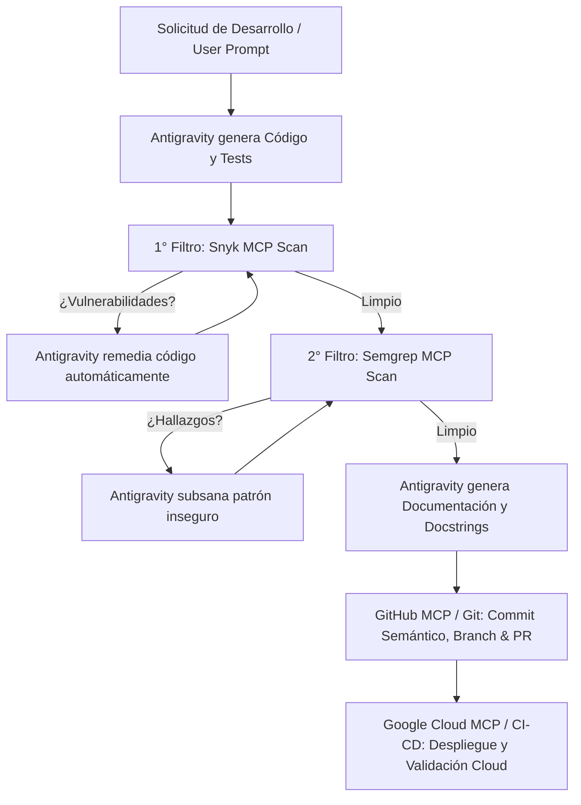

# 🤖 Instalación y Configuración desde Google Antigravity (IDE & 2.0)

Este documento detalla el procedimiento para instalar, inicializar y operar este proyecto directamente desde **Google Antigravity** (tanto en modo **IDE** como en **Antigravity 2.0 CLI / Agentic Stack**), incluyendo la configuración del cuarteto de servidores MCP: **Snyk**, **Semgrep**, **GitHub** y **Google Cloud**.

---

## 📥 Opción A: Instalación Inicial desde Antigravity IDE

1. **Abrir Antigravity IDE**:
   - Inicia Antigravity IDE en tu equipo.
   - Selecciona **File > Open Folder...** (o `Cmd+O` / `Ctrl+O`) y abre la carpeta raíz de este repositorio: `DEvSecOps Framework/`.
2. **Detección Automática de Reglas (`GEMINI.md`)**:
   - Antigravity detecta y aplica automáticamente el archivo [`GEMINI.md`](../GEMINI.md) y las reglas en [`.agent/rules/`](../.agent/rules/).
   - Verás en el panel lateral del agente que las directivas de seguridad y documentación ya se encuentran activas en el contexto.

---

## 💻 Opción B: Instalación Inicial desde Antigravity 2.0 CLI (`agy`)

Si utilizas el CLI de Antigravity (`agy`):

1. **Navegar al directorio del proyecto o clonar desde GitHub**:
   ```bash
   git clone https://github.com/<tu-organizacion>/<tu-repo>.git
   cd <tu-repo>
   ```
2. **Iniciar la sesión agéntica con el contexto del workspace**:
   ```bash
   agy
   ```
3. **Instruir a Antigravity para bootstrapear el entorno**:
   Puedes solicitarle directamente al prompt de Antigravity:
   > *"Hola Antigravity, por favor configura el entorno virtual local de Python, instala las dependencias de `app/requirements.txt`, ejecuta los tests unitarios y verifica el estado de las herramientas MCP."*

---

## 🔌 Configuración de Servidores MCP (Snyk, Semgrep, GitHub & Google Cloud)

Antigravity utiliza el **Model Context Protocol (MCP)** para extender las capacidades del agente hacia motores de seguridad, control de versiones e infraestructura en la nube.

### 1. Configuración Global de MCP en Antigravity
Edita o crea el archivo `~/.gemini/config/mcp_config.json` en tu máquina local (basado en [`.gemini/mcp_config.json.template`](../.gemini/mcp_config.json.template)):

```json
{
  "mcpServers": {
    "snyk": {
      "command": "npx",
      "args": ["-y", "@snyk/snyk-mcp-server"],
      "env": {
        "SNYK_TOKEN": "TU_SNYK_API_TOKEN"
      }
    },
    "semgrep": {
      "command": "semgrep",
      "args": ["mcp"],
      "env": {
        "SEMGREP_APP_TOKEN": "TU_SEMGREP_TOKEN"
      }
    },
    "github": {
      "command": "npx",
      "args": ["-y", "@modelcontextprotocol/server-github"],
      "env": {
        "GITHUB_PERSONAL_ACCESS_TOKEN": "TU_GITHUB_PAT_TOKEN"
      }
    },
    "google-cloud": {
      "command": "npx",
      "args": ["-y", "@google-cloud/mcp-server"],
      "env": {
        "GCP_PROJECT_ID": "TU_PROYECTO_GCP_ID",
        "GOOGLE_APPLICATION_CREDENTIALS": "/ruta/a/tu/credencial-gcp.json"
      }
    }
  }
}
```

---

## 🔑 Obtención de Credenciales para cada MCP

| Servidor MCP | Propósito | Dónde obtener el Token / Credencial |
| :--- | :--- | :--- |
| **Snyk** | 1er Filtro SAST & SCA | [app.snyk.io](https://app.snyk.io/) > *Account Settings > API Token* |
| **Semgrep** | 2do Filtro SAST & Fuga de Secretos | [semgrep.dev](https://semgrep.dev/) > *Settings > Tokens* |
| **GitHub** | Gestión de Repos, PRs, Commits e Issues | [github.com/settings/tokens](https://github.com/settings/tokens) > *Personal Access Tokens (Classic o Fine-grained)* |
| **Google Cloud** | Auditoría y consulta de Cloud Run, Artifact Registry y Logs | `gcloud auth application-default login` o Service Account JSON |

---

## 🔍 Verificar Servidores y Herramientas MCP en Antigravity

En el chat de Antigravity, puedes verificar que todas las herramientas estén disponibles:
> *"¿Cuáles herramientas de Snyk, Semgrep, GitHub y Google Cloud tienes disponibles?"*

Herramientas esperadas por servidor:
- **Snyk:** `snyk_code_scan`, `snyk_sca_scan`, `snyk_container_scan`, `snyk_iac_scan`.
- **Semgrep:** Escaneo de patrones de seguridad y detección de credenciales en código.
- **GitHub:** `create_repository`, `create_pull_request`, `push_files`, `create_branch`, `get_issue`, etc.
- **Google Cloud:** Inspección de servicios Cloud Run, consulta de logs en Cloud Logging, estado de Artifact Registry.

---

## 🛠️ Flujo de Desarrollo Asistido por Antigravity

Al solicitarle a Antigravity la creación o modificación de una funcionalidad, el ciclo se ejecuta automáticamente según las reglas de `GEMINI.md`:



### Ejemplo de Prompt para Antigravity:
> *"Crea un nuevo endpoint para autenticación JWT en `/api/v1/auth/login`. Aplica el 1er filtro con Snyk y el 2do filtro con Semgrep, añade pruebas unitarias, documenta todos los esquemas Pydantic y crea el Pull Request en GitHub usando tu herramienta MCP."*
